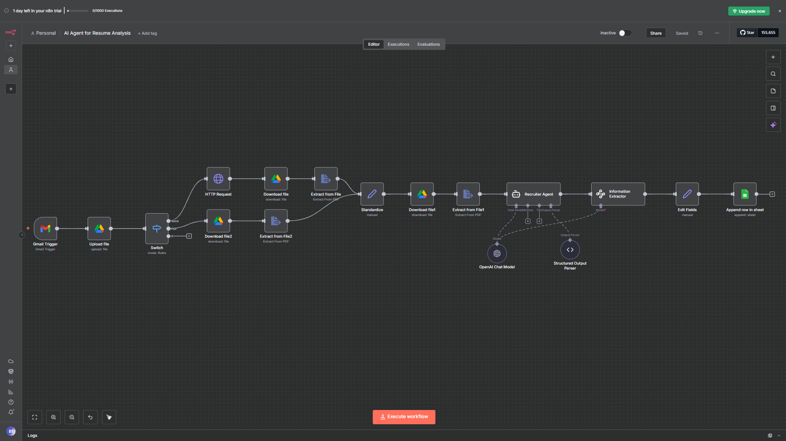
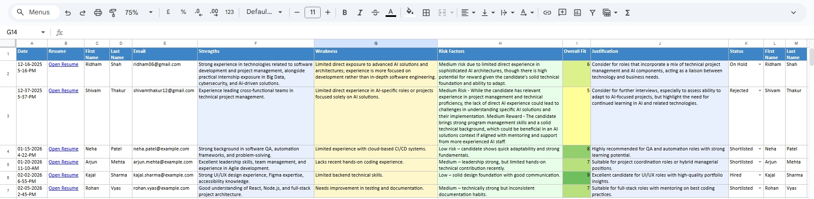

# AI Resume Processing Workflow — Automated Resume Extraction, Analysis & Storage using n8n + ChatGPT

Modern, end-to-end resume automation that ingests Gmail attachments, parses them with OpenAI, and stores structured outcomes in Google Drive or downstream systems.

---

## Overview

This documentation showcases an AI-powered automation workflow that streamlines resume processing from inbox to insight. Built with n8n, Gmail, Google Drive, and OpenAI, the workflow removes manual effort by collecting resumes, extracting text, and generating structured candidate intelligence automatically.

**Problem it solves**

- Manual downloading, renaming, and cataloging of resume attachments.
- Time-consuming resume parsing and skill extraction.
- Fragmented tooling for storing, analyzing, and sharing candidate data.

**Who it’s for**

- HR teams and recruiters seeking faster screening.
- ATS/platform developers embedding AI-driven parsing.
- Automation engineers building resume-to-dataset pipelines.

---

## Key Features

- **Gmail auto-fetch attachments**: Watches a hiring inbox, filters relevant emails, and ingests resumes in PDF/DOC/DOCX formats.
- **Google Drive auto-upload**: Organizes files into structured folders by sender, subject, role, or submission date.
- **Download & text extraction**: Retrieves the stored documents and converts them into clean text for downstream processing.
- **AI parsing with OpenAI API**: Sends extracted content to ChatGPT (GPT-4o / GPT-3.5) for deep resume understanding.
- **Resume classification & structured insights**: Produces JSON with candidate profiles, skills, experience summaries, and optional job-fit scoring.
- **Optional backend API integration**: Pushes parsed data into ATS, dashboards, or custom REST endpoints via HTTP Request nodes.

---

## Demo & Screenshots

  
_Complete n8n workflow orchestration_

  
_Excel Sheet Output_

---

## Tech Stack

- **n8n** – visual automation engine orchestrating the workflow.
- **Gmail API** – inbound resume ingestion from monitored inboxes.
- **Google Drive API** – centralized storage and archival for attachments.
- **OpenAI ChatGPT API** – natural language understanding and resume parsing.
- **HTTP Request Node** – integration with external services or APIs.
- **JSON Processing** – transformation, validation, and structuring of AI output.

---

## Workflow Architecture

```
┌─────────────┐     ┌─────────────┐     ┌─────────────┐     ┌─────────────┐     ┌──────────────┐     ┌──────────────┐
│   Gmail     │ --> │  n8n Trigger│ --> │ Google Drive│ --> │ Text Extract │ --> │  OpenAI GPT  │ --> │ JSON Delivery │
│ (New Email) │     │   & Filters │     │  Auto-Store │     │   & Cleanup  │     │ Structured AI│     │ API / Storage │
└─────────────┘     └─────────────┘     └─────────────┘     └─────────────┘     └──────────────┘     └──────────────┘
```

1. Gmail trigger detects new attachments.
2. Files are uploaded to Google Drive with dynamic organization.
3. Resumes are downloaded and converted into machine-readable text.
4. Text is sent to OpenAI for parsing, classification, and scoring.
5. Structured JSON is delivered to an API endpoint, database, or dashboards.

---

## Use Cases

- AI-first resume parsing and screening automation.
- Applicant Tracking System (ATS) ingestion pipelines.
- Job-matching and candidate scoring engines.
- HR analytics dashboards and talent marketplaces.
- Recruitment agencies needing rapid insights.
- Portfolio showcase for automation engineers.

---

## Future Enhancements

- Batch processing for high-volume resume drops.
- Candidate scoring dashboards with visual analytics.
- Resume-to-job-description similarity matching.
- Google Sheets and Slack notifications for distributed teams.
- Database connectors (MySQL, PostgreSQL, MongoDB) for persistent storage.

---

## Contributing

This repository is documentation-only. Suggestions, typo fixes, and improvements to the README are welcome via issues or pull requests.

---

## License

Licensed under the MIT License. See `LICENSE` for details.

---

## Contact

- **Author**: Yugant Trivedi
- **GitHub**: [github.com/yuganttrivedi](https://github.com/yuganttrivedi)
- **Email**: [yuganttrivedi2212@gmail.com](mailto:yuganttrivedi2212@gmail.com)

If you find this useful, consider starring the repo. Thanks!
